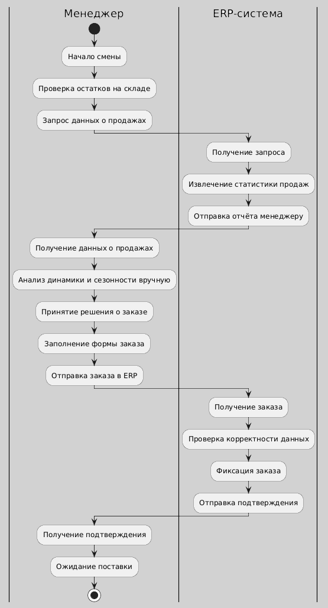
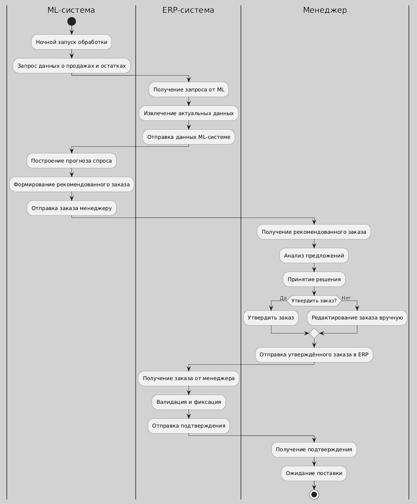
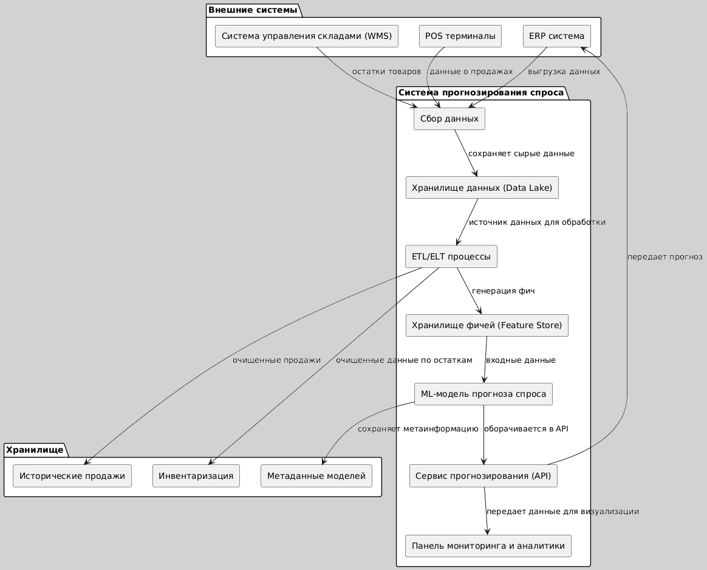
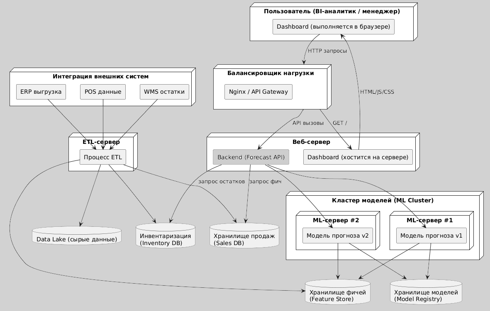
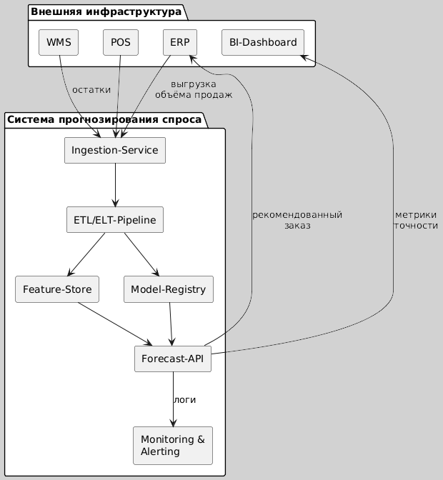
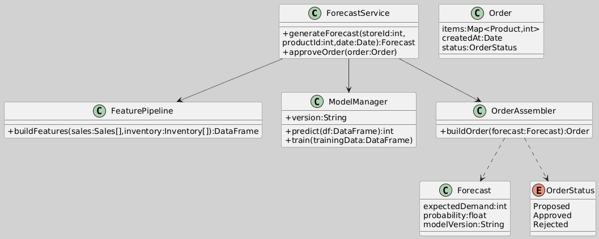
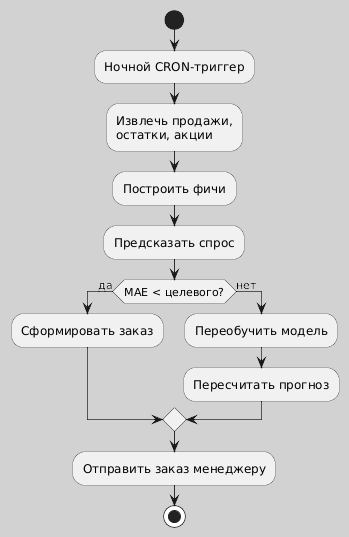
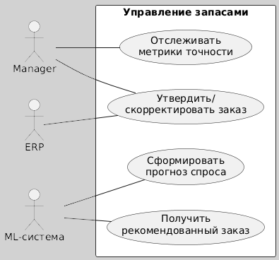
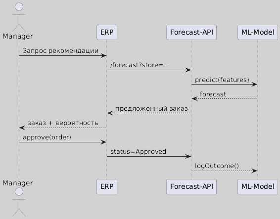

# ML System Design Doc

## Состав команды
1. Ксения Анисимова К3341 — Архитектор данных, Дата-аналитик
2. Элина Борисова К3341 — Архитектор системы и данных

## Кейс 3
**Бизнес-цель:** Оптимизировать управление товарными запасами и логистикой путем точного прогнозирования спроса на товары в каждой точке продаж сети супермаркетов.

**Описание текущего процесса:**

Сейчас заказы товаров формируются вручную на основе интуиции менеджеров → частые ошибки (избыток/дефицит) ведут к потерям из-за просроченных товаров (молоко, хлеб) или упущенной выручки при отсутствии товара (спрос есть, продавать нечего).

Руководство сети хочет автоматизировать процесс управления запасами и логистикой, чтобы уменьшить ошибки и увеличить выручку. В качестве данных предполагается использование накопленной статистики по продажам каждого товара в каждом магазине за последний год.

Количество уникальных товаров в сети - 10_000. Количество магазинов - 500. Количество продаж за последний год по всей сети - 2_670_000_000
## Отчет
> ### Термины
> * WMS = warehouse management system
> * POS = point of sail
> * ERP = enterprise resource planning
> * ETL = extract, transform, load
> * ELT = extract, load, transform

### Бизнес-процессы
#### До

#### После

#### Разница
Внедрение информационной системы с элементами машинного обучения кардинально меняет подход к управлению товарными запасами в сети супермаркетов. Ранее формирование заказов осуществлялось вручную, исходя из личного опыта и интуиции менеджеров, что нередко приводило к ошибкам — как к излишкам, так и к дефициту товаров. С внедрением новой системы прогнозирование спроса будет происходить автоматически, с опорой на анализ исторических продаж, сезонных колебаний, погодных условий и других значимых факторов. Это обеспечит более точное планирование закупок, сократит потери от списаний и недополученной выручки, снизит нагрузку на персонал и ускорит процесс принятия решений. ERP-система перестаёт быть просто инструментом учёта и становится активным звеном в цепочке интеллектуального управления. Менеджер теперь выполняет роль контролёра и корректировщика рекомендаций, а не ручного прогнозиста, что уменьшает влияние субъективных решений и делает бизнес-процесс более стабильным и предсказуемым.

Сущности:
* Store — магазин, уникальный по store_id.
* Product — товар с категориальными характеристиками.
* Sales — исторические продажи (ключевая таблица для ML).
* Forecast — предсказания спроса по товарам в магазинах.
* Inventory — текущее состояние склада (можно использовать как фичу и как выход для обратной связи).
### Диаграмма архитектуры системы

Краткое описание компонентов:
* ERP / WMS / POS — внешние источники.
* Сбор данных и ETL — передают и трансформируют информацию.
* Feature Store и ML-модель — основа ML-системы.
* Forecast API — интерфейс доступа к прогнозам.
* Dashboard — визуализация результатов для бизнеса.
* Хранилища — логическое разделение для данных.

#### Deployment

### Структурная UML-диаграмма
#### Диаграмма компонентов 

#### Диаграмма классов

### Поведенческая UML-диаграмма 
#### Диаграмма активностей

#### Диаграмма прецедентов

#### Диаграмма последовательностей

## Дизайн ML системы - Управление логистикой и товарными запасами

## 1. Цели и предпосылки
### 1.1. Зачем идем в разработку продукта?
* Снизить убытки из-за **избыточных** или **недостаточных** запасов.
* Снизить списания скоропортящихся товаров на ≥15%.
* Повысить **выручку** на 2–4%, исключив ситуации, когда товара нет, но есть спрос.
* Автоматизировать формирование заказов, **снизив зависимость от человеческого фактора** .

### 1.2. Почему станет лучше с ML?
* ML-модель может учитывать **сезонность, тренды, промоакции, выходные, погоду** и другие влияющие факторы.
* **Масштабируемость**: в отличие от ручного подхода, алгоритм может работать сразу для всех магазинов и товаров.
* Возможность **переобучения и адаптации** под изменения рынка.

### 1.3. Бизнес-требования и ограничения:
* Прогноз должен учитывать логистические ограничения (вместимость склада, частота поставок).
* **Точность прогноза** — особенно важна для скоропортящихся товаров.
* Не должно быть **существенного роста ИТ-затрат**.
* Возможность **интеграции с существующей ERP/системой заказов**.
* **Интерпретируемость** для менеджеров (возможно, объяснение "почему так").
* * Время вывода MVP — ≤ 4 месяцев

### 1.4. Функциональные требования:
* Прогноз спроса на горизонте **месяц вперед** по каждому товару и магазину.
* Рекомендации по **объему заказа** с учетом текущих остатков и логистических ограничений.
* Уведомления об **аномалиях** или резких скачках спроса.

### 1.5. Нефункциональные требования:
* Высокая **доступность** и **масштабируемость**.
* Возможность обработки **большого объема данных** (миллиарды строк истории).
* **Обновление модели** не реже 1 раза в неделю.

### 1.6. MVP vs Технический долг:
**MVP:**
* Time series forecasting по ключевым SKU (молочные, хлеб).
* Прогноз на 7 дней.
* REST API с прогнозами и базовый дешборд.
* ML pipeline на LightGBM + baseline.

**Технический долг:**
* Поддержка всех >10,000 товаров.
* Интеграция прогноза gjujls  с логистикой.
* Использование дополнительных факторов (погода, конкуренты и пр.)
* Автоматическая переобучаемость и drift detection.

## 2. Методология
### 2.1. Тип задачи:
* **Регрессия во времени (Time Series Forecasting)**: прогноз объема продаж.
* Дополнительно — **анализ аномалий**, возможно — **кластеризация** магазинов по поведению.
* Model:
  + Baseline: EMA + safety stock → сравнение с ML.
  + Ensemble: градиентный бустинг (LightGBM/CatBoost) + LSTM/DeepAR.
  + Anomaly detection: Isolation Forest или Z-score для неожиданных пиков.

### 2.2. Необходимые данные:
* Исторические продажи: `product_id`, `store_id`, `date`, `units_sold`.
* Цены, скидки/промоакции.
* Сезонные признаки: дни недели, праздники.
* Остатки на складах/полках.
* Возможно: погодные данные, конкуренты (в будущем).

### 2.3. Метрики качества ML:
* **MAE (Mean Absolute Error)** или **MAPE (Mean Absolute Percentage Error)** на уровне `product_id × store_id`.
* p90 Stock-out Rate.
* Бизнес-связь: снижение MAPE → меньше недозаказов и переизбытка → меньше потерь.

### 2.4. Потенциальные риски:
* **Неполные/грязные данные**, особенно по акциям.
* Перекос данных: **long tail** товаров с низкой частотой продаж.
* Переобучение под "шум" в истории.
* Сложности с **агрегацией спроса на логистические единицы** (ящики, упаковки).

## 3. Пилот
### 3.1. Подготовка:
* Выбрать **10–20 магазинов** и **100–200 товаров** (с высокой оборачиваемостью).
* История за 1 год → обучаемся на 11 месяцев, прогнозируем на 1.

### 3.2. Способ оценки:
* A/B: 50% магазинов на ML, 50% — ручной заказ.
* Проверка статистической значимости разницы (t-test).
* Измерить:
  + Среднюю **точность прогноза** (MAPE)
  + Потери от **out-of-stock** и **overstock**
  + Время на формирование заказов

### 3.3. Критерии успеха:
* MAPE < 20% по ключевым категориям.
* Снижение out-of-stock на >15%.
* Уменьшение потерь от списаний минимум на 10%.

## 4. Внедрение Production-системы
### 4.1. Архитектура решения:
**1. Хранилище данных (DWH)**:
* История продаж, акции, остатки, логистика, метаданные товаров/магазинов.

**2. Data Processing (ETL)**:
* Ежедневная агрегация и очистка данных.
* Обогащение данными о погоде, праздниках.

**3. ML Pipeline**:
* Обновление моделей по расписанию (еженедельно или ежедневно).
* Model training: MLflow + Docker + GPU‑nodes (если LSTM).

**4. API-сервис**:
* Feature Store: Feast или аналог для versioned features.
* Model serving: FastAPI/Flask, TorchServe (если нейросети).

**5. Интерфейс/дашборд**:
* Прогноз спроса и рекомендации для менеджеров.
* Настройки чувствительности, выбор горизонта прогноза и т.д.

**6. Логирование / мониторинг**:
* MLOps & latency, MAE drift, SLA alerting — Prometheus + Grafana.

### 4.2. Инфраструктура:
* **Облако (AWS / GCP / Azure)** или **on-premises**, в зависимости от политики компании.
* Распределенные вычисления (Spark / Dask) для предобработки.
* ML — LightGBM / CatBoost / Temporal Fusion Transformers / Prophet / DeepAR.

### 4.3. Требования:
* SLA: 99.9% uptime.
* Latency: <1 сек. на 1 запрос прогноза; p95 latency < 200 мс.
* RPS: до 100 в пиковые моменты (например, генерация прогнозов на сутки вперед по всем магазинам и товарам).

### 4.4. Возможные риски:
* Низкое доверие менеджеров → важно визуализировать объяснение прогноза.
* Concept drift  → еженедельный retrain + А/В мониторинг.
* Некачественные данные → необходима автоматическая валидация, ежедневная сверка с хранилищем.
* Сложность масштабирования на всю сеть сразу → нужно итеративное внедрение.
* Отказ инфраструктуры → фоллбэк на rule-based EOQ
