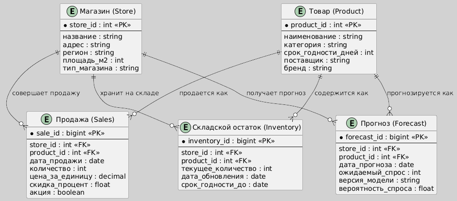

# ML System Design Doc

## Состав команды
1. Ксения Анисимова К3341 — Владелец продукта, Архитектор данных
2. Элина Борисова К3341 — Дата-аналитик, Архитектор системы

## Кейс 3
**Бизнес-цель:** Оптимизировать управление товарными запасами и логистикой путем точного прогнозирования спроса на товары в каждой точке продаж сети супермаркетов.

**Описание текущего процесса:**

Сейчас заказы товаров формируются вручную на основе интуиции менеджеров → частые ошибки (избыток/дефицит) ведут к потерям из-за просроченных товаров (молоко, хлеб) или упущенной выручки при отсутствии товара (спрос есть, продавать нечего).

Руководство сети хочет автоматизировать процесс управления запасами и логистикой, чтобы уменьшить ошибки и увеличить выручку. В качестве данных предполагается использование накопленной статистики по продажам каждого товара в каждом магазине за последний год.

Количество уникальных товаров в сети - 10_000. Количество магазинов - 500. Количество продаж за последний год по всей сети - 2_670_000_000
## Отчет
### Бизнес-процессы
#### До

#### После

#### Разница
Разрабатываемая информационная система с использованием машинного обучения значительно трансформирует бизнес-процессы управления товарными запасами в сети супермаркетов. Ранее заказы формировались вручную на основе интуиции менеджеров, что часто приводило к ошибкам, избыточным или недостаточным запасам. После внедрения системы прогноз спроса будет автоматически формироваться на основе анализа исторических данных о продажах, сезонности, погодных условий и других факторов. Это позволит повысить точность заказов, сократить количество списаний и упущенной выручки, снизить трудозатраты менеджеров, а также ускорить процесс принятия решений. ERP-система из простого регистратора заказов превращается в полноценный источник данных и участника автоматизированного обмена информацией. Менеджер при этом переходит от ручного прогнозирования к роли контролёра и корректировщика рекомендаций, что снижает влияние человеческого фактора и повышает устойчивость бизнес-процесса в целом.
### Диаграмма структуры данных

Сущности:
* Store — магазин, уникальный по store_id.
* Product — товар с категориальными характеристиками.
* Sales — исторические продажи (ключевая таблица для ML).
* Forecast — предсказания спроса по товарам в магазинах.
* Inventory — текущее состояние склада (можно использовать как фичу и как выход для обратной связи).
### Диаграмма архитектуры системы

* WMS = warehouse management system
* POS = point of sail
* ERP = enterprise resource planning
* ETL = extract, transform, load
* ELT = extract, load, transform

Краткое описание компонентов:
* ERP / WMS / POS — внешние источники.
* Сбор данных и ETL — передают и трансформируют информацию.
* Feature Store и ML-модель — основа ML-системы.
* Forecast API — интерфейс доступа к прогнозам.
* Dashboard — визуализация результатов для бизнеса.
* Хранилища — логическое разделение для данных.

#### Deployment

### Структурная UML-диаграмма
#### Диаграмма компонентов 

#### Диаграмма классов

### Поведенческая UML-диаграмма 
#### Диаграмма активностей

#### Диаграмма прецедентов

#### Диаграмма последовательностей

## Дизайн ML системы - Управление логистикой и товарными запасами

## 1. Цели и предпосылки
### 1.1. Зачем идем в разработку продукта?
* Снизить убытки из-за **избыточных** или **недостаточных** запасов.
* Уменьшить **долю просроченной продукции**, особенно в категориях с коротким сроком хранения (молоко, хлеб).
* Повысить **выручку**, исключив ситуации, когда товара нет, но есть спрос.
* Автоматизировать формирование заказов, **снизив зависимость от человеческого фактора**.

### 1.2. Почему станет лучше с ML?
* ML-модель может учитывать **сезонность, тренды, промоакции, выходные, погоду** и другие влияющие факторы.
* **Масштабируемость**: в отличие от ручного подхода, алгоритм может работать сразу для всех магазинов и товаров.
* Возможность **переобучения и адаптации** под изменения рынка.

### 1.3. Бизнес-требования и ограничения:
* **Точность прогноза** — особенно важна для скоропортящихся товаров.
* Не должно быть **существенного роста ИТ-затрат**.
* Возможность **интеграции с существующей ERP/системой заказов**.
* **Интерпретируемость** для менеджеров (возможно, объяснение "почему так").

### 1.4. Функциональные требования:
* Прогноз спроса на горизонте **1–14 дней вперед** по каждому товару и магазину.
* Рекомендации по **объему заказа** с учетом текущих остатков и логистических ограничений.
* Уведомления об **аномалиях** или резких скачках спроса.

### 1.5. Нефункциональные требования:
* Высокая **доступность** и **масштабируемость**.
* Возможность обработки **большого объема данных** (миллиарды строк истории).
* **Обновление модели** не реже 1 раза в неделю.

### 1.6. MVP vs Технический долг:
**MVP должно включать:**
* Прогнозирование спроса по ключевым товарным категориям (молочные, хлебобулочные).
* Прогноз на 7 дней вперед.
* Прототип интерфейса для менеджеров.

**Технический долг:**
* Поддержка всех 10,000 товаров.
* Интеграция прогноза с логистикой.
* Использование дополнительных факторов (погода, конкуренты и пр.)

## 2. Методология
### 2.1. Тип задачи:
* **Регрессия во времени (Time Series Forecasting)**: прогноз объема продаж.
* Дополнительно — **анализ аномалий**, возможно — **кластеризация** магазинов по поведению.

### 2.2. Необходимые данные:
* Исторические продажи: `product_id`, `store_id`, `date`, `units_sold`.
* Цены, скидки/промоакции.
* Сезонные признаки: дни недели, праздники.
* Остатки на складах/полках.
* Возможно: погодные данные, конкуренты (в будущем).

### 2.3. Метрики качества ML:
* **MAE (Mean Absolute Error)** или **MAPE (Mean Absolute Percentage Error)** на уровне `product_id × store_id`.
* Бизнес-связь: снижение MAPE → меньше недозаказов и переизбытка → меньше потерь.

### 2.4. Потенциальные риски:
* **Неполные/грязные данные**, особенно по акциям.
* Перекос данных: **long tail** товаров с низкой частотой продаж.
* Переобучение под "шум" в истории.
* Сложности с **агрегацией спроса на логистические единицы** (ящики, упаковки).

## 3. Пилот
### 3.1. Подготовка:
* Выбрать **10–20 магазинов** и **100–200 товаров** (с высокой оборачиваемостью).
* История за 1 год → обучаемся на 11 месяцев, прогнозируем на 1.

### 3.2. Способ оценки:
* Сравнить прогнозы ML vs фактические продажи и vs ручные заказы.
* Измерить:
* Среднюю **точность прогноза** (MAPE)
* Потери от **out-of-stock** и **overstock**
* Время на формирование заказов

### 3.3. Критерии успеха:
* MAPE < 20% по ключевым категориям.
* Снижение out-of-stock на >15%.
* Уменьшение потерь от списаний минимум на 10%.

## 4. Внедрение Production-системы
### 4.1. Архитектура решения:
**1. Хранилище данных (DWH)**:
* История продаж, акции, остатки, логистика, метаданные товаров/магазинов.

**2. Data Processing (ETL)**:
* Ежедневная агрегация и очистка данных.
* Обогащение данными о погоде, праздниках.

**3. ML Pipeline**:
* Обновление моделей по расписанию (еженедельно или ежедневно).
* Использование MLflow или аналогов для трекинга моделей.

**4. API-сервис**:
* Выдача прогнозов по запросу (REST API) → ERP/BI/интерфейс заказов.

**5. Интерфейс/дашборд**:
* Прогноз спроса и рекомендации для менеджеров.
* Настройки чувствительности, выбор горизонта прогноза и т.д.

**6. Логирование / мониторинг**:
* MLOps: мониторинг точности, дрейфа данных, задержек.

### 4.2. Инфраструктура:
* **Облако (AWS / GCP / Azure)** или **on-premises**, в зависимости от политики компании.
* Распределенные вычисления (Spark / Dask) для предобработки.
* ML — LightGBM / CatBoost / Temporal Fusion Transformers / Prophet / DeepAR.

### 4.3. Требования:
* SLA: 99.9% uptime.
* Latency: <1 сек. на 1 запрос прогноза.
* RPS: до 100 в пиковые моменты (например, генерация прогнозов на сутки вперед по всем магазинам и товарам).

### 4.4. Возможные риски:
* Низкое доверие менеджеров → важно визуализировать объяснение прогноза.
* Ошибки данных → необходима автоматическая валидация.
* Сложность масштабирования на всю сеть сразу — нужно итеративное внедрение.
